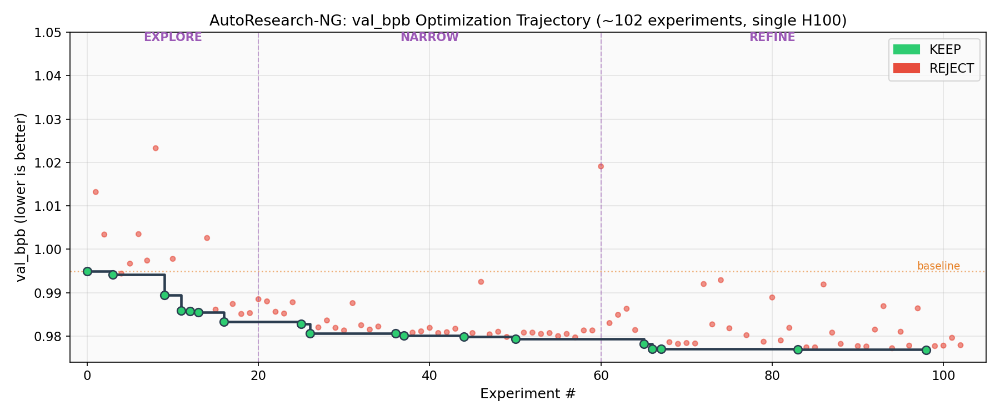
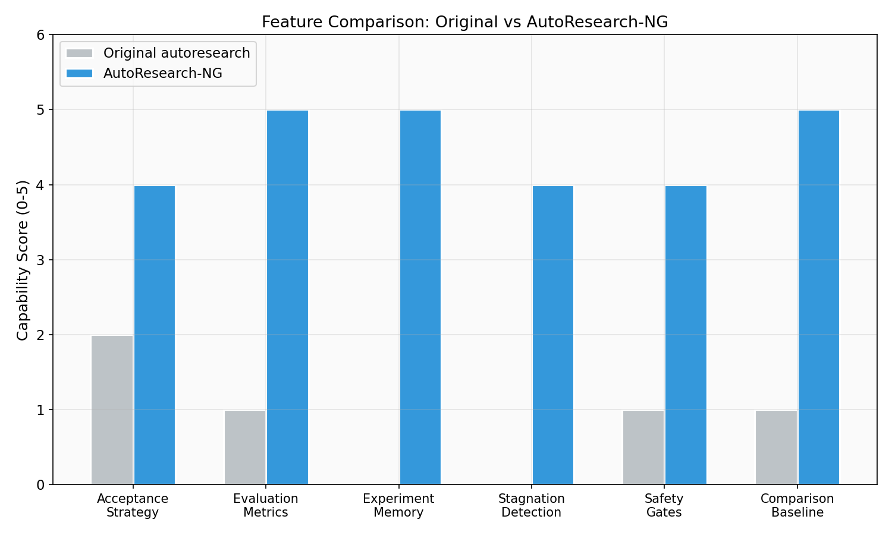
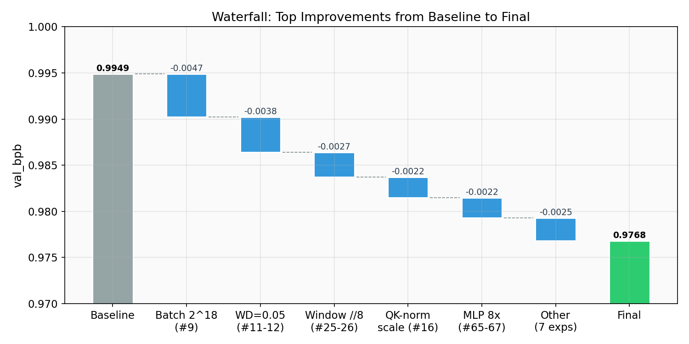
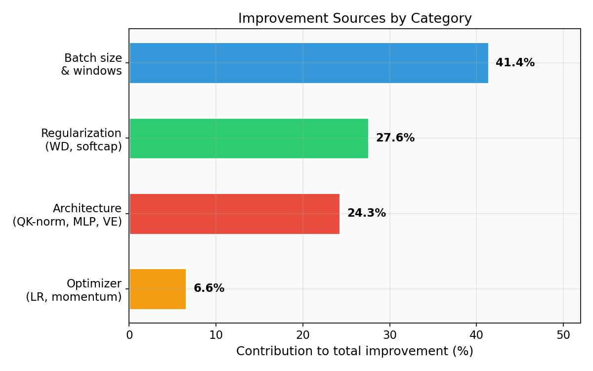
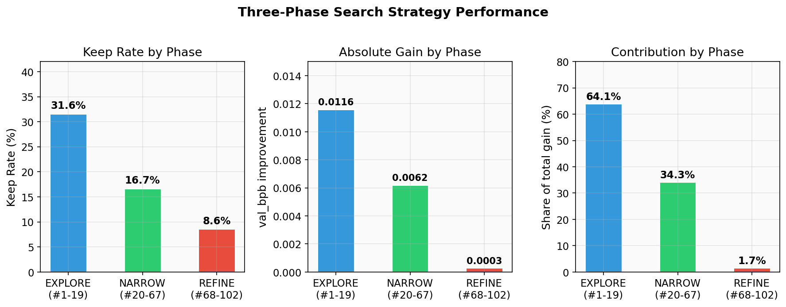

# AutoResearch-NG

**Next-generation optimization loop for [karpathy/autoresearch](https://github.com/karpathy/autoresearch).**

Drop-in overlay that adds simulated annealing, multi-objective evaluation, persistent experience memory, meta-optimization, staged safety gates, and Pareto front tracking — without modifying any original autoresearch files.

---

## Results at a Glance

Over ~10 hours on a single H100 80GB GPU, AutoResearch-NG ran **102 experiments** and reduced `val_bpb` from **0.9949 to 0.9768** — a **1.82% improvement** with 17 successful modifications out of ~85 rejected ones.



---

## Why AutoResearch-NG?

Karpathy's [autoresearch](https://github.com/karpathy/autoresearch) runs an AI agent in a loop: modify `train.py` → train for 5 minutes → check if `val_bpb` improved → keep or discard → repeat. One GPU, one file, one metric. It is elegant and effective.

However, the original design has six structural limitations that become apparent during extended overnight runs. AutoResearch-NG addresses each one:

| # | Original Limitation | NG Solution | How It Helps |
|---|---|---|---|
| 1 | **Greedy ratchet** — only accepts strict improvements | **Simulated annealing** — probabilistically accepts small regressions | Escapes local optima; explores wider search space |
| 2 | **Single metric** — only tracks `val_bpb` | **Multi-objective evaluation** — primary + constraint + secondary metrics + Pareto front | Prevents Goodhart's Law; catches throughput/memory regressions |
| 3 | **No memory** — each experiment is decided independently | **Structured experience log** — JSONL records with hypothesis, result, insight | Avoids redundant exploration; learns from failures |
| 4 | **Fixed strategy** — same search approach from start to finish | **Meta-optimization triggers** — detects stagnation and injects new strategies | Breaks through plateaus automatically |
| 5 | **No safety checks** — relies on agent discipline | **Staged safety gates** — syntax check, constraint validation, baseline regression detection | Catches drift before it compounds |
| 6 | **Single comparison** — only compares to previous best | **Three-tier comparison** — vs last best, vs original baseline, vs Pareto front | Ensures real progress, not incremental noise |



---

## How It Works

### Core Principle: Simulated Annealing over Greedy Search

The original autoresearch uses a **greedy ratchet**: if an experiment improves `val_bpb`, keep it; otherwise, discard it. This is simple and safe, but it can get trapped in local optima — once you commit to a configuration, you can never cross a "valley" to reach a potentially better peak.

AutoResearch-NG replaces this with **simulated annealing**:

```
Temperature:  T = T₀ × 0.95^(experiment_number),  T₀ = 0.05,  T_min = 0.001

Acceptance rule:
  val_bpb improved     → ALWAYS ACCEPT
  val_bpb degraded ≤10% → accept with probability P = exp(-Δ/T)
  val_bpb degraded >10% → ALWAYS REJECT
  constraint violated   → ALWAYS REJECT
```

The temperature starts high (willing to accept regressions) and decays exponentially toward greedy behavior. This creates a natural three-phase search:

| Phase | Experiments | Temperature | Strategy |
|---|---|---|---|
| **EXPLORE** | 1–20 | High (0.05–0.02) | Bold, diverse experiments: architecture changes, radical hyperparameter shifts |
| **NARROW** | 21–60 | Medium (0.02–0.005) | Focus on promising directions, combine winning changes, test interactions |
| **REFINE** | 61+ | Low (0.005–0.001) | Fine-tune best configuration, precision adjustments |

### Multi-Objective Evaluation

Instead of a single scalar metric, NG tracks three tiers:

- **Primary metric** (must improve): `val_bpb` — vocabulary-size-independent model quality
- **Constraint metrics** (must not violate): `peak_memory_mb ≤ 80GB`, `training_steps ≥ 50`, `code_lines ≤ 1200`, no new dependencies
- **Secondary metrics** (max 15% degradation allowed): `throughput_tokens_per_sec`, `parameter_count`, `training_steps`

A new experiment **dominates** the current best only when `val_bpb` strictly decreases AND all constraints hold AND no secondary metric degrades by more than 15%.

### Persistent Experience Memory

After every experiment, a structured record is appended to `experience.jsonl`:

```json
{
  "id": 42,
  "phase": "NARROW",
  "temperature": 0.012,
  "hypothesis": "Wider MLP should add capacity now that step count is maximized",
  "change_summary": "MLP hidden dim 4x → 6x",
  "change_category": "architecture",
  "result": "KEEP",
  "metrics": {"val_bpb": 0.9771, "training_steps": 1689, ...},
  "insight": "Width > depth under fixed time budget",
  "next_direction": "Try 8x MLP width"
}
```

Before each experiment, the agent reads the last 15 entries to:
- Identify **exhausted directions** (3+ consecutive failures in same category)
- Identify **promising directions** (>30% success rate)
- Never repeat an exact change that previously failed
- Prioritize untested combinations of individually successful changes

### Meta-Optimization Triggers

The system monitors for stagnation and automatically initiates a strategy review when ANY condition is met:

1. **Stuck**: 5+ consecutive REJECTs
2. **Low yield**: success rate < 10% over last 20 experiments
3. **Tunnel vision**: last 10 experiments all in the same category
4. **Plateau**: no improvement in 15 experiments
5. **Diminishing returns**: last 5 KEEPs each improved by < 0.001

When triggered, the agent reads the full experiment log, diagnoses the bottleneck, generates a new search strategy, and resumes with a warm temperature restart (T reset to T₀ × 0.5).

### Safety Gates

**Per-experiment (automatic):**
1. Syntax check: `python -c "import ast; ast.parse(open('train.py').read())"`
2. Constraint pre-check: code_lines ≤ 1200, no new imports
3. Smoke test: training must produce output within 60 seconds
4. Constraint post-check: all metrics within bounds

**Every 10 experiments (automatic):**
1. Baseline regression test — restore original `train.py`, re-run, compare
2. Complexity audit — warn if cyclomatic complexity or code lines grew excessively

---

## Experiment Results

### Overall Performance

| Metric | Value |
|---|---|
| Baseline val_bpb | 0.994888 |
| Final best val_bpb | 0.976752 |
| Absolute improvement | 0.018136 |
| Percentage improvement | **1.823%** |
| Total experiments | ~102 |
| KEEP decisions | 17 |
| REJECT decisions | ~85 |
| Runtime | ~10 hours (single H100 80GB) |

### Top Improvements by Impact



| Rank | Experiment | Change | val_bpb Gain | Category |
|---|---|---|---|---|
| 1 | #9 | Batch size 2^19 → 2^18 | -0.0047 | Training efficiency |
| 2 | #11-12 | Weight decay 0.2 → 0.05 | -0.0038 | Regularization |
| 3 | #25-26 | Sliding window seq_len//2 → //8 | -0.0027 | Attention mechanism |
| 4 | #16 | QK-norm learnable scale | -0.0022 | Architecture |
| 5 | #65-67 | MLP width 4x → 8x | -0.0022 | Model capacity |

### Improvement Sources by Category



### Three-Phase Strategy Performance



| Phase | Experiments | KEEP Rate | val_bpb Gain | Share of Total Gain |
|---|---|---|---|---|
| EXPLORE (#1–19) | 19 | 31.6% | -0.0116 | 64.1% |
| NARROW (#20–67) | 48 | 16.7% | -0.0062 | 34.3% |
| REFINE (#68–102) | 35 | 8.6% | -0.0003 | 1.7% |

The EXPLORE phase delivered the most value per experiment. The three-phase temperature schedule ensures broad early exploration while converging toward the best configuration.

### Final Configuration vs Baseline

| Parameter | Baseline | Final | Change |
|---|---|---|---|
| val_bpb | **0.9949** | **0.9768** | -1.82% |
| Parameters | 50.3M | 83.9M | +66.8% |
| Training steps | 957 | 1,465 | +53.1% |
| MLP width | 4x | 8x | +100% |
| Batch size | 2^19 | 2^18 | -50% |
| Weight decay | 0.2 | 0.05 | -75% |
| Softcap | 15 | 12 | -20% |
| Short window | seq_len//2 | seq_len//8 | -75% |
| Window pattern | SSSL | SSL | More global attention |
| Warmdown | 0.5 | 0.67 | +34% |
| VE layers | 4/8 | 8/8 | All layers |
| QK-norm | Fixed | Learnable | Architectural improvement |
| Muon warmup | 300 steps | 100 steps | -67% |
| MATRIX_LR | 0.04 | 0.07 | +75% |
| Throughput | 1.67M tok/s | 1.29M tok/s | -22.8% |

### Key Findings

**What works (ranked by impact):**

1. **More optimizer steps** via smaller batch size — the single biggest lever in fixed-time training
2. **Less regularization** (WD 0.2 → 0.05) — short training regimes are already under-fitted
3. **Shorter attention windows** — saves FLOPs, enabling more steps without quality loss
4. **Learnable QK-norm scale** — a free architectural improvement (no extra compute)
5. **Wider MLP** (4x → 8x) — adds crucial capacity once step efficiency is maximized
6. **Value Embeddings on every layer** — beneficial capacity at modest compute cost

**What does not work:**

1. Deeper models (DEPTH > 8) — always fewer steps within the time budget
2. SwiGLU, GELU^2, CReLU^2 — all slower than ReLU^2 for this workload
3. Parallel attention+MLP — hurts at small scale
4. Label smoothing — destroys the BPB metric
5. GQA (Grouped Query Attention) — loses too much Value Embedding capacity
6. HEAD_DIM=64 — kills H100 tensor core utilization

### Meta-Strategy Insight

The optimal search order is strictly sequential:

```
Phase 1: Maximize training steps (batch size, attention windows)  → biggest gains
Phase 2: Tune hyperparameters (LR, WD, softcap, warmdown)        → free gains
Phase 3: Add model capacity (MLP width, Value Embeddings)         → final push
```

**Attempting Phase 3 before Phase 1 always failed.** Extra parameters cannot be adequately trained when step count is insufficient. This ordering insight is arguably more valuable than any single experiment's improvement.

---

## Quick Start

```bash
# 1. Clone autoresearch and the NG overlay
git clone https://github.com/karpathy/autoresearch
git clone https://github.com/wzljerry/autoresearch-ng

# 2. Copy NG files into autoresearch
cd autoresearch
cp ../autoresearch-ng/program.md .
cp ../autoresearch-ng/prepare_ng.py .
cp ../autoresearch-ng/CLAUDE.md .

# 3. One-time setup (data prep + baseline)
bash ../autoresearch-ng/setup.sh

# 4. Run (same as original autoresearch)
claude
```

**Requirements:** Python 3.10+, a single NVIDIA GPU, [uv](https://github.com/astral-sh/uv), and [Claude Code](https://docs.anthropic.com/en/docs/claude-code).

Usage is identical to the original autoresearch — run `claude` in the directory and walk away. The NG improvements are communicated to the agent through `CLAUDE.md` → `program.md`.

## Files Added (3 files, ~43KB total)

```
program.md      Agent instructions: annealing schedule, multi-objective definitions,
                memory rules, safety gates, meta-optimization triggers.
prepare_ng.py   Utility library: multi-metric collection, constraint checking,
                annealing decisions, Pareto front, experience logging.
setup.sh        One-click setup: data prep → baseline → git init → launch.
```

### Files Generated at Runtime

```
experience.jsonl       Structured log of every experiment (hypothesis, result, insight)
pareto_front.json      Non-dominated solutions across multiple objectives
baseline_metrics.json  Snapshot of initial metrics for regression detection
results.tsv            Extended experiment log (original format + new columns)
stage_summaries/       Markdown summaries generated every 15 experiments
meta_strategy.md       New search strategy (auto-generated when stagnation detected)
```

## Adapting to Other Tasks

The NG framework is task-agnostic. To apply it beyond nanochat training:

1. **Define your editable asset** — the file(s) the agent modifies
2. **Define your evaluation function** — modify `collect_all_metrics()` in `prepare_ng.py`
3. **Define your objectives** — update the Objectives section in `program.md`

Everything else (annealing, memory, Pareto, meta-optimization, safety gates) works unchanged.

## Project Structure

```
autoresearch-ng/
├── README.md           This file
├── CLAUDE.md           Auto-read by Claude Code on launch
├── LICENSE             MIT
├── CONTRIBUTING.md     How to contribute
├── program.md          Agent instructions (replaces original)
├── prepare_ng.py       NG utility library (supplements original)
├── setup.sh            One-time data prep and baseline
├── generate_figures.py Script to regenerate figures from experiment data
└── figures/            Experiment result visualizations
    ├── fig1_trajectory.png   val_bpb optimization trajectory
    ├── fig2_categories.png   Improvement sources by category
    ├── fig3_phases.png       Three-phase strategy performance
    ├── fig4_comparison.png   Feature comparison: Original vs NG
    └── fig5_waterfall.png    Top improvements waterfall chart
```

## Related Work

- [karpathy/autoresearch](https://github.com/karpathy/autoresearch) — The original. Start here if you haven't.
- [Bilevel Autoresearch](https://arxiv.org/abs/2603.23420) — Meta-optimization paper. Key inspiration for the meta-optimization feature.
- [SkyPilot parallel autoresearch](https://blog.skypilot.co/scaling-autoresearch/) — Scaling to 16 GPUs with factorial experiment design.
- [EvoScientist](https://github.com/EvoScientist/EvoScientist) — Persistent experience memory for autoresearch.
- [awesome-autoresearch](https://github.com/alvinunreal/awesome-autoresearch) — Curated index of the autoresearch ecosystem.
- [autoexp](https://gist.github.com/adhishthite/16d8fd9076e85c033b75e187e8a6b94e) — Generalized autoresearch for any quantifiable metric.

## License

MIT. See [LICENSE](LICENSE).
